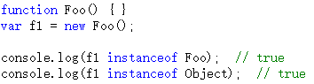
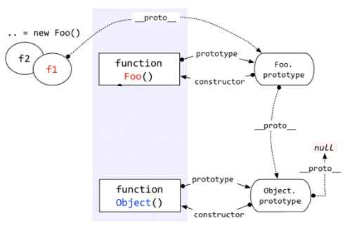
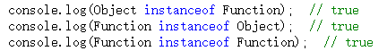

# instanceof
又介绍一个老朋友——instanceof。

对于值类型，你可以通过typeof判断，string/number/boolean都很清楚，但是typeof在判断到引用类型的时候，返回值只有object/function，你不知道它到底是一个object对象，还是数组，还是new Number等等。

这个时候就需要用到instanceof。例如：

上图中，f1这个对象是被Foo创建，但是“f1 instanceof Object”为什么是true呢？

 

至于为什么过会儿再说，先把instanceof判断的规则告诉大家。根据以上代码看下图：

Instanceof运算符的第一个变量是一个对象，暂时称为A；第二个变量一般是一个函数，暂时称为B。

Instanceof的判断队则是：**沿着A的__proto__这条线来找，同时沿着B的prototype这条线来找，如果两条线能找到同一个引用，即同一个对象，那么就返回true。如果找到终点还未重合，则返回false**。

按照以上规则，大家看看“ f1 instanceof Object ”这句代码是不是true？ 根据上图很容易就能看出来，就是true。

 

通过上以规则，你可以解释很多比较怪异的现象，例如：

这些看似很混乱的东西，答案却都是true，这是为何？

正好，这里也接上了咱们上一节说的“乱”。

上一节咱们贴了好多的图片，其实那些图片是可以联合成一个整体的，即：

看这个图片，千万不要嫌烦，必须一条线一条线挨着分析。如果上一节你看的比较仔细，再结合刚才咱们介绍的instanceof的概念，相信能看懂这个图片的内容。

看看这个图片，你也就知道为何上面三个看似混乱的语句返回的是true了。

问题又出来了。Instanceof这样设计，到底有什么用？到底instanceof想表达什么呢？

重点就这样被这位老朋友给引出来了——**继承**——**原型链**。

即，**instanceof表示的就是一种继承关系，或者原型链的结构**。请看下节分解。

（注：本节的图片来源于http://www.ibm.com/developerworks/cn/web/1306_jiangjj_jsinstanceof/figure1.jpg）