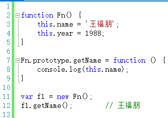

# 补this
本文对[this](index.md)一篇进行补充

原文中，讲解了在javascript中this的各个情况，写完之后发现还落下一种情况，就此补充。

 

原文中this的其中一种情况是构造函数的，具体的内容可以参考原文，此处不再赘述。

要补充的内容是，在构造函数的prototype中，this代表着什么。

如上代码，在Fn.prototype.getName函数中，this指向的是f1对象。因此可以通过this.name获取f1.name的值。

**其实，不仅仅是构造函数的prototype，即便是在整个原型链中，this代表的也都是当前对象的值。**