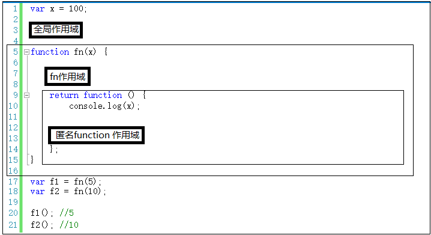
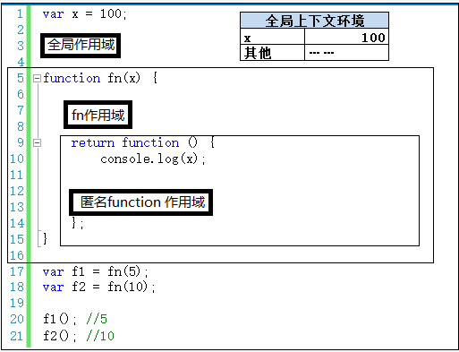
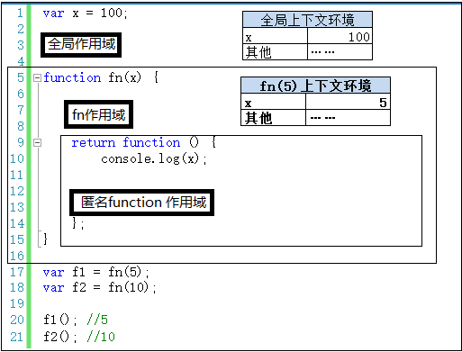
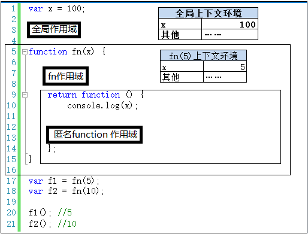
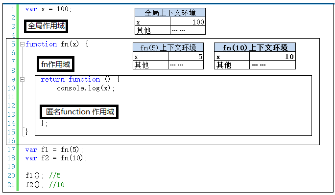

# 补充：上下文环境和作用域的关系
本系列用了大量的篇幅讲解了上下文环境和作用域，有些人反映这两个是一回儿事。本文就用一个小例子来说明一下，作用域和上下文环境绝对不是一回事儿。

 

再说明之前，咱们先用简单的语言来概括一下这两个的区别。

**00 上下文环境：**

可以理解为一个看不见摸不着的对象（有若干个属性），虽然看不见摸不着，但确实实实在在存在的，因为所有的变量都在里面存储着，要不然咱们定义的变量在哪里存？

另外，对于函数来说，上下文环境是在调用时创建的，这个很好理解。拿参数做例子，你不调用函数，我哪儿知道你要给我传什么参数？

**01 作用域：**

首先，它很抽象。第二，记住一句话：除了全局作用域，只有函数才能创建作用域。创建一个函数就创建了一个作用域，无论你调用不调用，函数只要创建了，它就有独立的作用域，就有自己的一个“地盘”。

**02 两者：**

一个作用域下可能包含若干个上下文环境。有可能从来没有过上下文环境（函数从来就没有被调用过）；有可能有过，现在函数被调用完毕后，上下文环境被销毁了；有可能同时存在一个或多个（闭包）。

 

上面的文字不理解没关系，且看下面的例子。

第一，除了全局作用域外，每个函数都要创建一个作用域。作用域之间的变量是相互独立的。因此，全局作用域中的x和fn作用域中的x，两者毫无关系，互不影响，和平相处。

第二，程序执行之前，会生成全局上下文环境，并在程序执行时，对其中的变量赋值。

第三，程序执行到第17行，调用fn(5)，会产生fn(5)的上下文环境，并压栈，并设置为活动状态。

第四，执行完第17行，fn(5)的返回值赋值给了f1。此时执行上下文环境又重新回到全局，但是fn(5)的上下文环境不能就此销毁，因为其中有闭包的引用（可翻看前面文章，此处不再赘述）。

第五，继续执行第18行，再次调用fn函数——fn(10)。产生fn(5)的上下文环境，并压栈，并设置为活动状态。**但是此时fn(5)的上下文环境还在内存中——一个作用域下同时存在两个上下文环境。**

讲到这里，重点已经讲出来了，之后的场景这里就不再赘述了。

目的还是希望大家能通过这个例子，来理清楚上下文环境和作用域的关系。当然，也不是非得像个学院派似的一字一文的把概念说出来，简单理解一下，对用闭包是有帮助的。