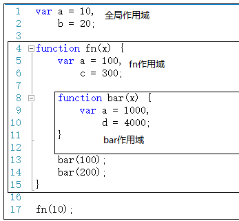
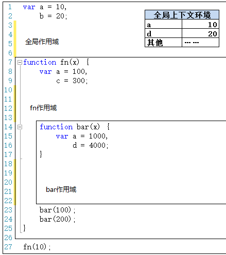
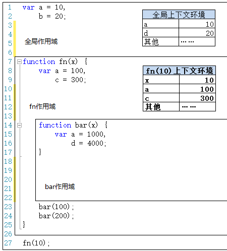
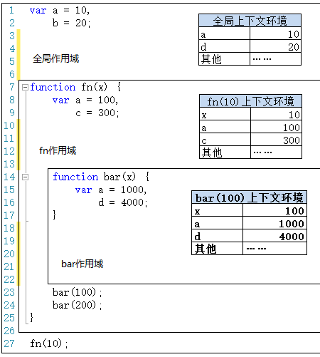
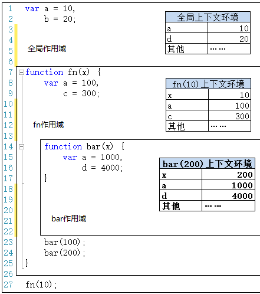
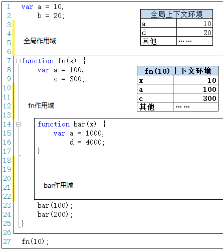
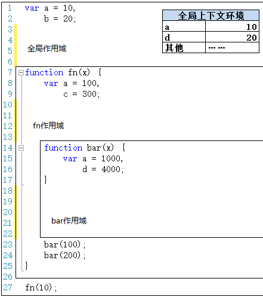
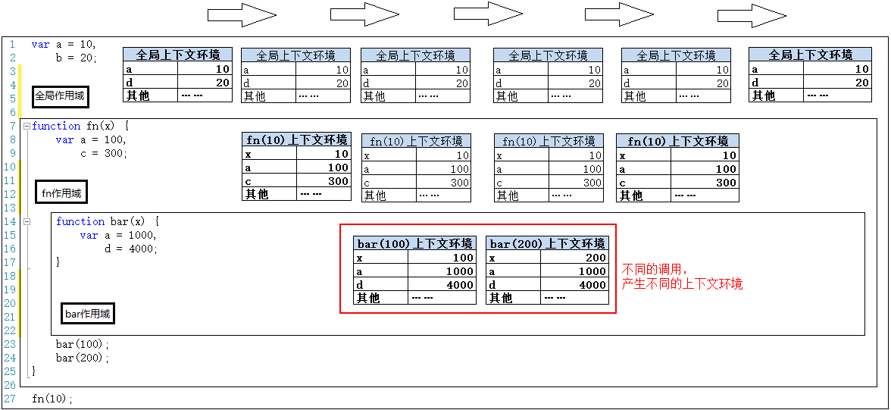

# 【作用域】和【上下文环境】
上文简单介绍了作用域，本文把作用域和上下文环境结合起来说一下，会理解的更深一些。

如上图，我们在上文中已经介绍了，除了全局作用域之外，每个函数都会创建自己的作用域，作用域在函数定义时就已经确定了。而不是在函数调用时确定。

下面我们将按照程序执行的顺序，一步一步把各个上下文环境加上。另外，对上下文环境不了解的朋友，可以去看看之前的两篇文章：
* [简述【执行上下文】上](../简述执行上下文/index.md)
* [简述【执行上下文】下](../简述执行上下文/index1.md)

第一步，在加载程序时，已经确定了全局上下文环境，并随着程序的执行而对变量就行赋值。

第二步，程序执行到第27行，调用fn(10)，此时生成此次调用fn函数时的上下文环境，压栈，并将此上下文环境设置为活动状态。

第三步，执行到第23行时，调用bar(100)，生成此次调用的上下文环境，压栈，并设置为活动状态。

第四步，执行完第23行，bar(100)调用完成。则bar(100)上下文环境被销毁。接着执行第24行，调用bar(200)，则又生成bar(200)的上下文环境，压栈，设置为活动状态。

第五步，执行完第24行，则bar(200)调用结束，其上下文环境被销毁。此时会回到fn(10)上下文环境，变为活动状态。

第六步，执行完第27行代码，fn(10)执行完成之后，fn(10)上下文环境被销毁，全局上下文环境又回到活动状态。

结束了。像老太太的裹脚布——又臭又长！

最后我们可以把以上这几个图片连接起来看看。

连接起来看，还是挺有意思的。**作用域只是一个“地盘”，一个抽象的概念，其中没有变量。要通过作用域对应的执行上下文环境来获取变量的值**。同一个作用域下，不同的调用会产生不同的执行上下文环境，继而产生不同的变量的值。所以，**作用域中变量的值是在执行过程中产生的确定的，而作用域却是在函数创建时就确定了**。

所以，**如果要查找一个作用域下某个变量的值，就需要找到这个作用域对应的执行上下文环境，再在其中寻找变量的值**。

 

虽然本文很长，但是文字较少，图片居多，图片都有形象的展示，大家花十几分钟也能慢慢看完。但是，这节内容真的很重要。

以上代码中，咱们还没有设计到跨作用域取值的情况，即——自由变量。详细内容且听下回分解。