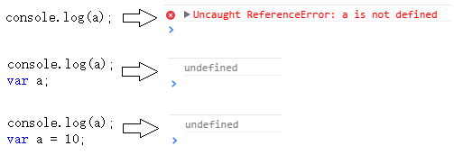
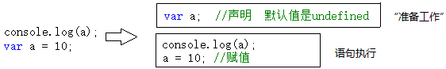
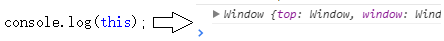
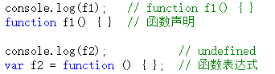
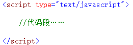
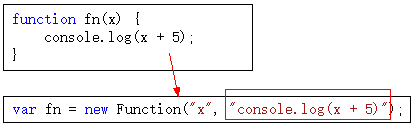

# 简述【执行上下文】上
什么是“执行上下文”（也叫做“执行上下文环境”）？暂且不下定义，先看一段代码：



第一句报错，a未定义，很正常。第二句、第三句输出都是undefined，说明浏览器在执行console.log(a)时，已经知道了a是undefined，但却不知道a是10（第三句中）。

在一段js代码拿过来真正一句一句运行之前，浏览器已经做了一些“准备工作”，其中就包括对变量的声明，而不是赋值。变量赋值是在赋值语句执行的时候进行的。可用下图模拟：



这是第一种情况。


下面还有。先来个简单的。



有js开发经验的朋友应该都知道，你无论在哪个位置获取this，都是有值的。至于this的取值情况，比较复杂，会专门拿出一篇文章来讲解。

与第一种情况不同的是：第一种情况只是对变量进行声明（并没有赋值），而此种情况直接给this赋值。这也是“准备工作”情况要做的事情之一。

 

下面还有。。。第三种情况。

在第三种情况中，需要注意代码注释中的两个名词——“函数表达式”和“函数声明”。虽然两者都很常用，但是这两者在“准备工作”时，却是两种待遇。



看以上代码。“函数声明”时我们看到了第二种情况的影子，而“函数表达式”时我们看到了第一种情况的影子。

没错。在“准备工作”中，对待函数表达式就像对待“ var a = 10 ”这样的变量一样，只是声明。而对待函数声明时，却把函数整个赋值了。

 

好了，“准备工作”介绍完毕。

我们总结一下，在“准备工作”中完成了哪些工作：
* **变量、函数表达式——变量声明，默认赋值为undefined；**
* **this——赋值；**
* **函数声明——赋值；**

**这三种数据的准备情况我们称之为“执行上下文”或者“执行上下文环境”。**


*这里插一句题外话：通过以上三种情况，你可能会联想到网上的有些考js语法的题目/面试题。的确，几乎每个js语法题中都有这种题目出现。之前你遇到这种题目是不是靠背诵来解决？背过了，隔几天又忘记了。——任何问题，都要去追根溯源，要知道这个问题是真正出自哪一块知识点，要真正去理解。光靠背诵是没用的。*

细心的朋友可能会发现，我们上面所有的例子都是在全局环境下执行的。

其实，javascript在执行一个代码段之前，都会进行这些“准备工作”来生成执行上下文。这个“代码段”其实分三种情况——全局代码，函数体，eval代码。

 

这里解释一下为什么代码段分为这三种。

所谓“代码段”就是一段文本形式的代码。

首先，全局代码是一种，这个应该没有非议，本来就是手写文本到<script>标签里面的。



其次，eval代码接收的也是一段文本形式的代码。
```
eval("alert(123)");
```

最后，函数体是代码段是因为函数在创建时，本质上是 new Function(…) 得来的，其中需要传入一个文本形式的参数作为函数体。



这样解释应该能理解了。

最后，eval不常用，也不推荐大家用。

下一节我们介绍函数的情况，并一起总结一下执行上下文到底包含哪些内容。敬请期待。